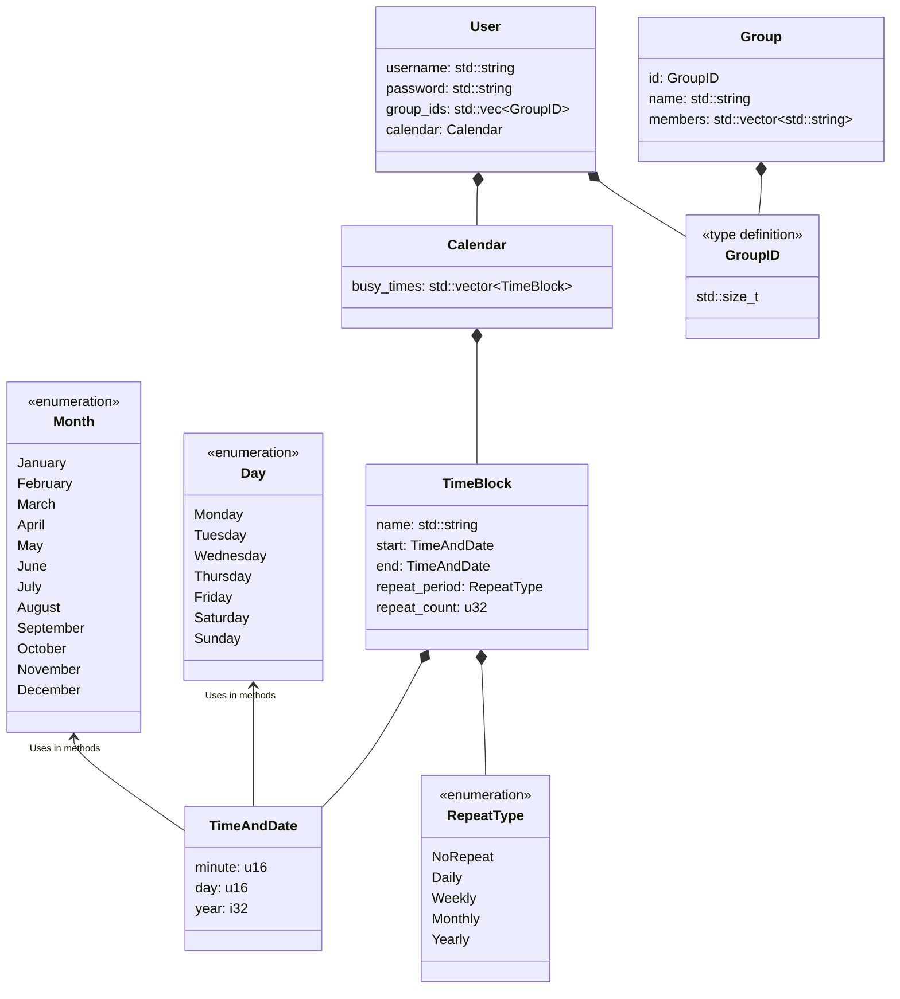

# Rock Chalk Rendezvous Class Diagram

```mermaid
classDiagram
    direction TB
    
    class GroupID {
        <<type definition>>
        std::size_t
    }
    
    class RepeatType {
        <<enumeration>>
        NoRepeat
        Daily
        Weekly
        Monthly
        Yearly
    }
    
    class Month {
        <<enumeration>>
        January
        February
        March
        April
        May
        June
        July
        August
        September
        October
        November
        December
    }
    
    class Day {
        <<enumeration>>
        Monday
        Tuesday
        Wednesday
        Thursday
        Friday
        Saturday
        Sunday
    }
    
    class TimeAndDate {
        minute: u16
        day: u16
        year: i32
    }
    
    class TimeBlock {
        name: std::string
        start: TimeAndDate
        end: TimeAndDate
        repeat_period: RepeatType
        repeat_count: u32
    }
    
    class Calendar {
        busy_times: std::vector~TimeBlock~
    }
    
    class User {
        username: std::string
        password: std::string
        group_ids: std::vec~GroupID~
        calendar: Calendar
    }
    
    class Group {
        id: GroupID
        name: std::string
        members: std::vector~std::string~
    }
    
    
    
    User *-- Calendar
    User *-- GroupID
    Calendar *-- TimeBlock
    TimeBlock *-- TimeAndDate
    TimeBlock *-- RepeatType
    Group *-- GroupID
    
    Month "Uses in methods" <-- TimeAndDate
    Day "Uses in methods" <-- TimeAndDate
    
    
    
    
```
