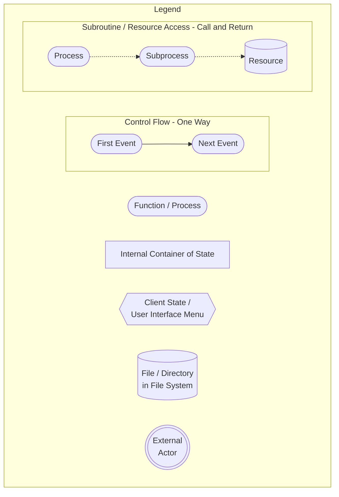
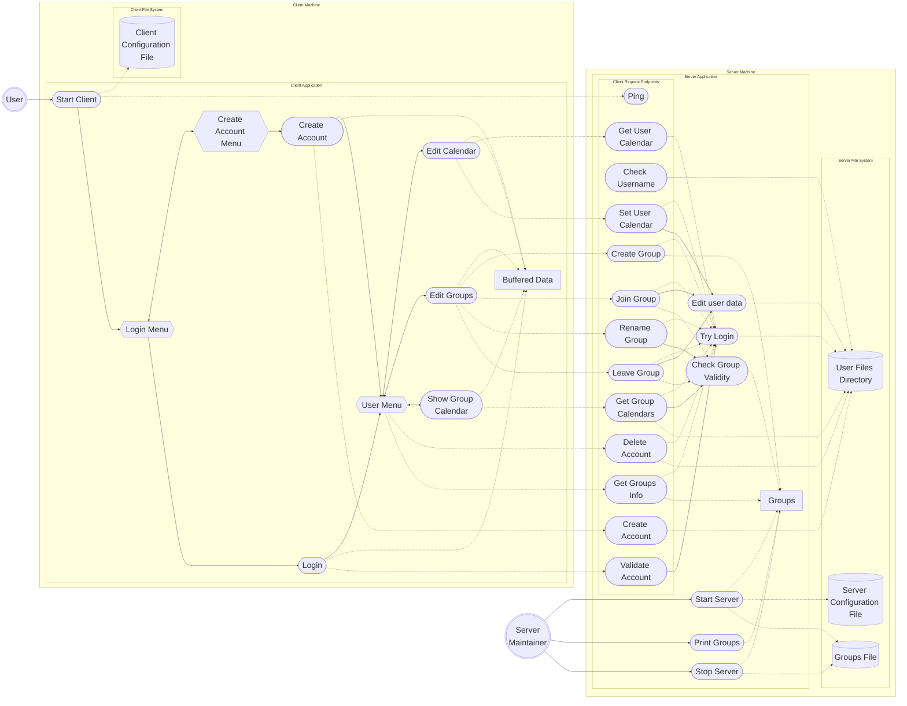

# Rock Chalk Rendezvous Functional Diagram

```mermaid
flowchart TB
    subgraph Legend
        p:([Function / Process])
        s:[Internal Container of State]
        c:{{Client State /\nUser Interface Menu}}
        f:[(File / Directory\nin File System)]
        a:(((External\nActor)))
        subgraph Control Flow - One Way
            direction LR
            e1:([First Event]) --> e2:([Next Event])
        end
        subgraph Subroutine / Resource Access - Call and Return
            direction LR
            e3:([Process]) -.-> e4:([Subprocess]) -.-> e5:[(Resource)]
        end
    end
```

```mermaid
flowchart LR
    classDef f font-size:24pt;
    
    subgraph Client Machine
        direction LR
        subgraph Client Application
            direction LR
            start_client:([Start Client]):::f
            login_menu:{{Login Menu}}:::f
            user_menu:{{User Menu}}:::f
            create_account_menu:{{Create Account Menu}}:::f
            edit_calendar:([Edit Calendar]):::f
            edit_groups:([Edit Groups]):::f
            show_group_calendar:([Show Group Calendar]):::f
            
            login:([Login]):::f
            ccreate_account:([Create Account]):::f
            buffered_data:[Buffered Data]:::f
            
            login_menu: <--> create_account_menu:
            login_menu: --> login:
            create_account_menu: --> ccreate_account:
            login: --> user_menu:
            ccreate_account: --> user_menu:
            user_menu: <--> edit_calendar:
            user_menu: <--> edit_groups:
            user_menu: <--> show_group_calendar:
            
            login: -.-> buffered_data:
            ccreate_account: -.-> buffered_data:
            edit_calendar: -.-> buffered_data:
            edit_groups: -.-> buffered_data:
            show_group_calendar: -.-> buffered_data:
        end
        
        subgraph Client File System
            direction TB
            ccfg:[(Client Configuration File)]:::f
        end
        
    end
    
    subgraph Server Machine
        direction LR
        subgraph Server Application
            direction LR
            
            subgraph Client Request Endpoints
                direction LR
                ping:([Ping]):::f
                create_account:([Create Account]):::f
                check_username:([Check Username]):::f
                validate_account:([Validate Account]):::f
                delete_account:([Delete Account]):::f
                get_user_calendar:([Get User Calendar]):::f
                set_user_calendar:([Set User Calendar]):::f
                get_groups:([Get Groups Info]):::f
                get_group_calendars:([Get Group Calendars]):::f
                create_group:([Create Group]):::f
                join_group:([Join Group]):::f
                rename_group:([Rename Group]):::f
                leave_group:([Leave Group]):::f
            end
            
            start_server:([Start Server]):::f
            print_groups:([Print Groups]):::f
            stop_server:([Stop Server]):::f
            
            groups:[Groups]:::f
            
            try_login:([Try Login]):::f
            cgv:([Check Group Validity]):::f
            eud:([Edit user data]):::f
            
            validate_account: --> try_login:
            delete_account: -.-> try_login:
            get_user_calendar: -.-> try_login:
            set_user_calendar: -.-> try_login:
            get_groups: -.-> try_login:
            get_group_calendars: -.-> try_login:
            create_group: -.-> try_login:
            join_group: -.-> try_login:
            rename_group: -.-> try_login:
            leave_group: -.-> try_login:
            
            set_user_calendar: --> eud:
            join_group: --> eud:
            leave_group: --> eud:
            
            cgv: -.-> groups:
            get_groups: -.-> groups:
            create_group: -.-> groups:
            
            get_group_calendars: --> cgv:
            join_group: -.-> cgv:
            rename_group: --> cgv:
            leave_group: -.-> cgv:
        end
        
        subgraph Server File System
            direction TB
            scfg:[(Server Configuration File)]:::f
            groups_file:[(Groups File)]:::f
            user_files:[(User Files Directory)]:::f
        end
        
        start_server: -.-> groups:
        start_server: -.-> scfg:
        start_server: -.-> groups_file:
        
        stop_server: -.-> groups:
        stop_server: -.-> groups_file:
        
        print_groups: -.-> groups:
        
        create_account: -..-> user_files:
        eud: -..-> user_files:
        check_username: -.-> user_files:
        try_login: -.-> user_files:
        delete_account: -.-> user_files:
        get_group_calendars: -.-> user_files:
        
    end
    
    
    user:(((User))):::f
    server_maintainer:(((Server\nMaintainer))):::f
    
    user: --> start_client:
    
    server_maintainer: ---> start_server:
    server_maintainer: --> print_groups:
    server_maintainer: --> stop_server:
    
    start_client: -.-> ccfg:
    start_client: -...-> ping:
    start_client: --> login_menu:
    
    login: -..-> validate_account:
    ccreate_account: -..-> create_account:
    user_menu: -..-> delete_account:
    edit_calendar: -..-> get_user_calendar:
    edit_calendar: -..-> set_user_calendar:
    user_menu: -..-> get_groups:
    show_group_calendar: -..-> get_group_calendars:
    edit_groups: -..-> create_group:
    edit_groups: -..-> join_group:
    edit_groups: -..-> rename_group:
    edit_groups: -..-> leave_group:
```
